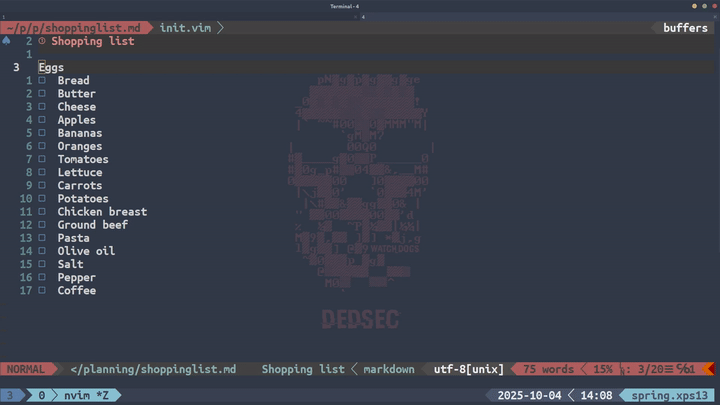

# toggle-checkbox.nvim
A fork from [opdavies/toggle-checkbox.nvim](https://github.com/opdavies/toggle-checkbox.nvim)

A Super-simple Neovim plugin for checking and unchecking Markdown checkboxes, written in Lua.

## Preview


## Quick Start
### Install
Using vim-plug
```vim
Plug 'reverie11/toggle-checkbox.nvim'
```

### Setup 
in your nvim config file `init.vim`
```vim
:lua require("toggle-checkbox")
```

### Keymapping
There are no default keymaps but these can be added using `vim.keymap.set()`:

```vim
:lua vim.keymap.set("n", "<leader>cc", ":ToggleCheckbox<CR>")
:lua vim.keymap.set("n", "<leader>cn", ":ToggleNCheckboxes ")
```
